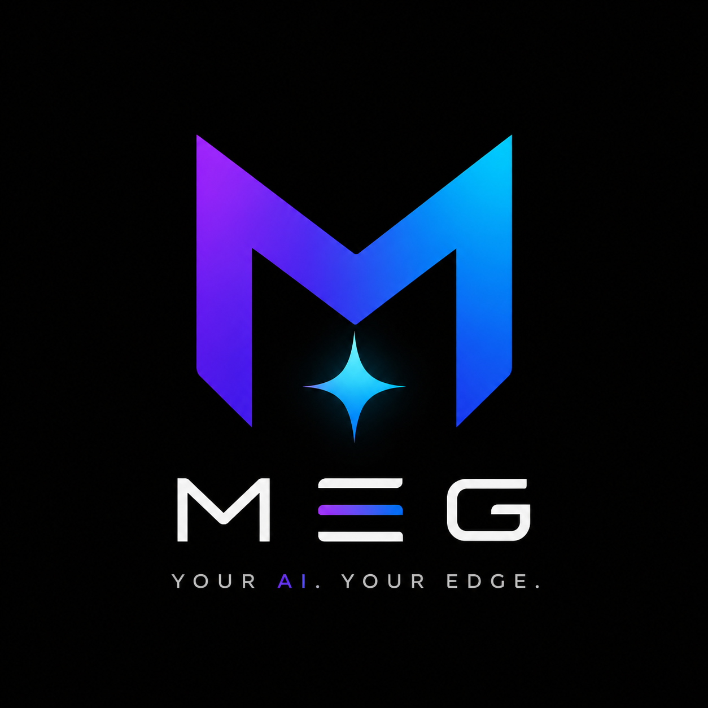

<div align="center">

# ✦ Meg ✦

### The local AI operating system for your desktop

[](https://github.com/Natnael-15/Meg/releases)
[](#requirements)
[](#requirements)
[](#development)
[](#license)

<br />

<a href="https://github.com/Natnael-15/Meg/releases/latest">
  
</a>
&nbsp;
<a href="https://github.com/Natnael-15/Meg/releases/latest">
  
</a>
<a href="https://github.com/Natnael-15/Meg/releases/latest">
  
</a>
<a href="https://github.com/Natnael-15/Meg/releases/latest">
  
</a>

<br />
<br />

**Private by default · Workspace-aware · Tool-using · MCP-enabled · Multi-modal · Multi-agent**

</div>

---

## 🎯 What is Meg?

<div align="center">
  
</div>

Meg is a **local-first AI desktop assistant** built with Electron, React, and LM Studio. Instead of treating an LLM like a plain chatbot, Meg wraps it in a full desktop operating layer — file access, terminal execution, tool permissions, background agents, automations, MCP integration, and domain-specific skill prompts.

Meg runs on **Windows, macOS, and Linux** and supports both **local models** (via LM Studio) and **cloud models** (OpenAI, Anthropic, Google, DeepSeek).

---

## 🚀 What's New in 2.0

Meg 2.0 is a complete overhaul — **9 phases of enhancement**, a full UI redesign, and **256 passing tests**. Here's everything that changed:

### 🐛 Phase 1 — Stabilize
Fixed 4 critical bugs: `completeChat` crash on automation document actions, per-agent tool allowlist being silently ignored, notification dismissal not persisting, and cloud model streams that couldn't be aborted mid-request.

### 🏗️ Phase 2 — Refactor
App.jsx reduced from **1,752 → 1,091 lines** (38% reduction). Extracted 5 hooks (`useUpdater`, `useApprovals`, `useTelegram`, `useWorkspaces`, `useChatState`), 3 components (`WinTitleBar`, `Onboarding`, `CommandPalette`), and 2 lib modules. Added ESLint + Prettier + typed action creators.

### 🔒 Phase 3 — Harden
Converted all filesystem operations to async (`fs/promises`). Added settings cache, Telegram approval gate, hardened command validation (whitespace normalization + expanded blocklist), SQLite index, and Myers diff algorithm.

### ✨ Phase 4 — Feature Up
- **MCP client** — connect to external Model Context Protocol servers
- **Multi-modal input** — paste, drag-drop, or screenshot images into chat
- **Token budget visualization** — live usage bar with auto-summarization indicator

### 📈 Phase 5 — Scale
- **Multi-agent orchestration** — parallel `spawn_agents` (up to 5) with shared scratchpad
- **Mac/Linux builds** — DMG, AppImage, DEB, tar.gz
- **Plugin system** — custom skills loaded from the filesystem

### 🧠 Phase 6 — Intelligence & Security
- **Cloud context redaction** — strips 11 secret patterns before sending to cloud
- **OS keychain** — encrypts API keys via macOS Keychain / Windows DPAPI / Linux libsecret
- **Conversation branching** — fork from any message
- **Voice output (TTS)** — Meg can speak its responses
- **Screenshot capture** — grab the screen and attach to chat

### 🔧 Phase 7 — Architecture & DevEx
- **GitHub Actions CI/CD** — lint + test + build on every push (Node 20 + 22)
- **Hook extraction** — `useWorkspaces`, `useChatState`, `useThreads`
- **Typed action creators** — replacing the raw event bus

### ⚡ Phase 8 — Power Features
- **Prompt templates** — 10 built-ins (code review, debug, refactor, tests, docs, standup, PR desc, commit msg, summarize)
- **Conversation export/import** — Markdown + JSON
- **Git integration** — stage, unstage, commit, diff, log, branch, checkout
- **Model A/B comparison** — send the same prompt to two models simultaneously

### 🎨 Phase 9 — Polish & Full UI Redesign
- **Dark-mode-first design system** — refined colors, 14px base font, semantic tokens
- **Every surface redesigned** — splash, icon rail, sidebar, chat header, message bubbles, input bar, tool call cards, code blocks, split pane, onboarding, settings, empty states
- **Semantic search** — scored + embeddings-based (auto-detects LM Studio embedding models)
- **Keyboard shortcuts overlay** — press `?` to see all shortcuts
- **GitHub OAuth device flow** — ready for production (needs client ID)
- **Keychain settings panel** — visible Security section with migration button

---

## 🛠️ What Meg Can Do

| Category | Feature | Description |
| :--- | :--- | :--- |
| **Chat** | Local AI Chat | Streams from LM Studio with thinking support, abort, and tool call cards |
| | Multi-Model | Routes to LM Studio, OpenAI, Anthropic, Google Gemini, DeepSeek |
| | Multi-Modal | Paste, drag-drop, or screenshot images — vision models analyze directly |
| | Token Budget | Live usage bar with auto-summarization threshold indicator |
| | Conversation Branching | Fork any conversation from a specific message |
| | Export / Import | Export as Markdown or JSON, import to restore or share |
| **Tools** | MCP Client | Connect to external MCP servers — filesystem, GitHub, databases, browser automation |
| | File Operations | Read, write, create, rename, delete, search — permission-aware |
| | Terminal Tools | Run commands, capture output, feed results back into the workflow |
| | Git Integration | Status, stage/unstage, commit, diff, log, branch, checkout |
| | Screenshot Capture | Grab the screen or a window, attach to next message |
| **Agents** | Multi-Agent Orchestration | Parallel fan-out via `spawn_agents` (up to 5) with shared scratchpad |
| | Agent Runs | Multi-step background execution with goal-mode planning |
| | Prompt Templates | 10 built-in + user-defined templates |
| **Security** | Cloud Context Redaction | Strips 11 secret patterns before sending to cloud providers |
| | OS Keychain | Encrypts API keys via macOS Keychain / Windows DPAPI / Linux libsecret |
| | Telegram Approval Gate | Prompt-injected messages can't silently run commands |
| | Hardened Commands | Whitespace normalization + expanded blocklist |
| | Write-Root Enforcement | File writes scoped to active workspace |
| **Intelligence** | Skills Engine | 31+ built-in expert profiles + custom skill plugins |
| | Auto Skill Detection | Automatically activates the most relevant skill |
| | Semantic Search | Scored + embeddings-based file search |
| | Model A/B Comparison | Send same prompt to two models, compare side-by-side |
| **Workflow** | Automations | Structured workflows via local runner and scheduler |
| | Approval Queue | Manual approvals or configurable bypass modes |
| | Mobile Link | Telegram integration for mobile notifications and remote control |
| **UX** | Dark Mode First | Refined dark-mode-first design system |
| | Voice I/O | Voice input + TTS voice output on responses |
| | Keyboard Shortcuts | `⌘K` palette, `Ctrl+F` search, `?` shortcuts overlay |
| | Diagnostics | Runtime diagnostics for startup, updater, renderer, process failures |

---

## 🔌 MCP (Model Context Protocol)

Meg connects to external MCP servers via stdio transport, surfacing their tools alongside Meg's built-in tools. Configure servers in **Settings → MCP Servers**.

**Popular MCP servers:**
- `@modelcontextprotocol/server-filesystem` — file system access
- `@modelcontextprotocol/server-github` — GitHub API
- `@modelcontextprotocol/server-postgres` — PostgreSQL queries
- `@modelcontextprotocol/server-puppeteer` — browser automation

Tool names are namespaced as `mcp__<server>__<tool>` to avoid collisions.

---

## 🎓 Skills System

31+ built-in expert profiles across 13 categories, plus a **plugin system** for custom skills.

<details>
<summary><b>View all built-in skills</b></summary>

| Category | Skills |
| :--- | :--- |
| **Languages** | Python, Node / API, TypeScript, React, Electron |
| **Frontend** | Web / UI, Senior Web Developer, Frontend Architect, Full-Stack Engineer |
| **Backend** | Backend Architect, API Designer, Database Designer |
| **Architecture** | Software Architect, Technical Lead, Systems Thinker |
| **Quality** | Testing Specialist, QA Engineer, Code Reviewer, Debugging Expert, Performance Engineer, Accessibility Expert |
| **Infrastructure** | DevOps Engineer, Git / GitHub Expert, Release Manager, Automation Engineer, PowerShell Expert |
| **AI & Data** | Data / ML Specialist, Data Analyst, AI Agent Builder, Prompt Engineer, Local AI Specialist |
| **Security** | Security Engineer |
| **Design** | UI/UX Designer, Product Designer, Design Systems Expert, Visual Designer, Motion Designer, Creative Director, Mobile UX Expert |
| **Documentation** | Documentation Writer, Technical Writer |
| **Product & Growth** | Product Manager, Startup Advisor, Business Strategist, Brand Strategist, Marketing Strategist, SEO Specialist, Copywriter, CRO Expert, App Launch Strategist |
| **Research** | Research Specialist, Research Analyst, Problem Solver |
| **Specialist** | Game Developer, Customer Experience Designer, Project Planner |

</details>

### Custom Skills (Plugin System)

Create a `.json` file in the `skills/` directory under your Meg userData folder:

```json
{
  "id": "rust-embedded",
  "name": "Rust Embedded",
  "icon": "🦀",
  "color": "#ce422b",
  "category": "Language",
  "desc": "no_std Rust for microcontrollers",
  "keywords": ["rust", "embedded", "no_std", "hal", "cortex-m"],
  "prompt": "ACTIVE SKILL — RUST EMBEDDED EXPERT:\n- Use no_std..."
}
```

Custom skills override built-ins on id collision.

---

## 🏗️ Architecture

```text
Meg Desktop App
├─ Renderer UI (React + Vite)
│  ├─ Chat surface (multi-modal, streaming, tool cards, TTS)
│  ├─ Skills selector (31 built-in + custom plugins)
│  ├─ Prompt templates library
│  ├─ Workspace views + file browser
│  ├─ Split editor / terminal view (Myers diff)
│  ├─ Agent dashboard (multi-agent orchestration)
│  ├─ Automation builder
│  ├─ Settings (Model · Integrations · MCP · Security · Permissions · Memory)
│  └─ Dark-mode-first design system
│
├─ Electron Main Process
│  ├─ LLM abstraction (LM Studio · OpenAI · Anthropic · Google · DeepSeek)
│  ├─ Tool layer (15+ built-in tools + MCP tool routing)
│  ├─ MCP client (JSON-RPC over stdio)
│  ├─ Approval queue (with Telegram approval gate)
│  ├─ Cloud context redaction (11 secret patterns)
│  ├─ OS keychain (safeStorage encryption)
│  ├─ Agent runner (fan-out · scratchpad · goal-mode)
│  ├─ Automation runner / scheduler
│  ├─ Custom skills loader (filesystem plugins)
│  ├─ Prompt templates + conversation export/import
│  ├─ Semantic search (scored + embeddings)
│  ├─ Git integration (8 operations)
│  ├─ Screenshot capture + OAuth device flow
│  ├─ Model A/B comparison
│  ├─ Settings cache + SQLite store
│  └─ Diagnostics
│
└─ Model Runtime
   └─ LM Studio OpenAI-compatible server (or cloud providers)
```

---

## 📥 Requirements

- **Windows** 10+ · **macOS** 11+ · **Linux** Ubuntu 20.04+
- [LM Studio](https://lmstudio.ai/) running locally at `http://127.0.0.1:1234`

**Recommended local models:**
- `ornith-9b` (Recommended — good for consumers)
- Qwen3-8B or similar Qwen coding/reasoning model
- DeepSeek-R1 distilled models
- Any OpenAI-compatible local model from LM Studio

**Cloud models (require API keys):**
- OpenAI (gpt-4o, gpt-4o-mini)
- Anthropic (claude-3-5-sonnet, claude-3-5-haiku)
- Google (gemini-1.5-pro, gemini-2.0-flash)
- DeepSeek (deepseek-chat, deepseek-reasoner)

---

## 💻 Development

```bash
npm install          # Install dependencies
npm run dev          # Start Vite + Electron dev environment
npm test             # Run tests (256 tests)
npm run lint         # ESLint
npm run format       # Prettier format
npm run build        # Build for all platforms
npm run build:win    # Windows NSIS installer
npm run build:mac    # macOS DMG + ZIP (x64 + arm64)
npm run build:linux  # Linux AppImage + DEB + tar.gz
```

---

## 🔄 CI/CD

GitHub Actions pipelines run on every push and PR:

| Pipeline | Triggers | What it does |
| :--- | :--- | :--- |
| **CI** | Push to `master`, PRs | Lint + test + renderer build (Node 20 + 22 matrix) |
| **Release** | Tag `v*`, GitHub release published | Full app builds for Windows + macOS + Linux, uploads to release |

---

## 📊 Project Stats

| Metric | Value |
| :--- | :--- |
| **Test suite** | 256 tests, 26 test files, all passing |
| **Main process modules** | 22 JavaScript files |
| **Renderer components** | 18 React components |
| **Custom hooks** | 6 hooks (`useUpdater`, `useApprovals`, `useTelegram`, `useWorkspaces`, `useChatState`, `useThreads`) |
| **Built-in tools** | 15+ (run_command, read_file, write_file, search_files, spawn_agents, scratchpad_*, MCP routing, ...) |
| **Built-in skills** | 31 across 13 categories |
| **Built-in templates** | 10 (code review, debug, refactor, tests, docs, standup, PR, commit, summarize) |
| **Redaction patterns** | 11 (OpenAI, Anthropic, GitHub, Slack, Stripe, AWS, Google, JWT, PEM, env passwords) |
| **Platforms** | Windows, macOS (x64 + arm64), Linux |

---

## 📝 License

MIT — see [`LICENSE`](LICENSE).

<div align="center">

Built with ❤️ by [Natnael-15](https://github.com/Natnael-15)

</div>
