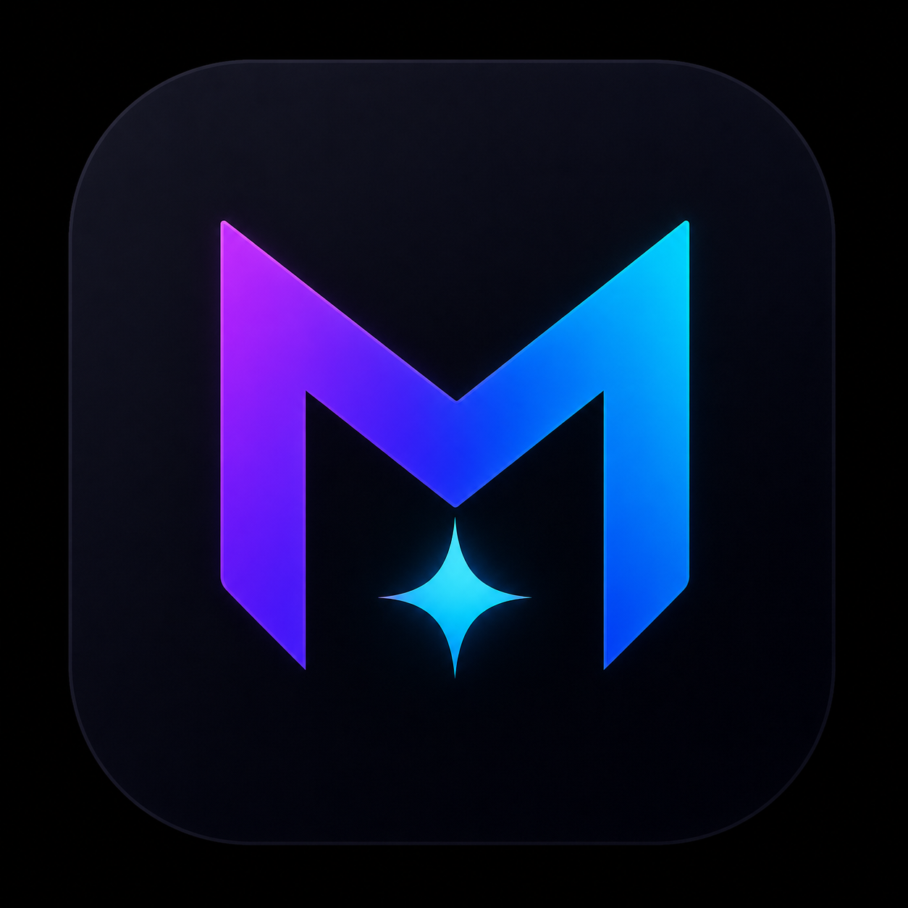

<div align="center">



# ✦ Meg ✦

### Local-first AI desktop assistant for coding, projects, automations, and everyday work

[](https://github.com/Natnael-15/Meg/releases)
[](#requirements)
[](#requirements)
[](#development)
[](#license)

<br />

**Private by default. Workspace-aware. Tool-using. Skill-driven. MCP-enabled. Multi-modal.**

</div>

---

## Overview

<div align="center">
  
</div>

**Meg** is a local-first AI desktop assistant built with Electron, React, and LM Studio. It is designed to give a local model a proper working environment: project context, file access, terminal execution, tool permissions, background agents, automations, domain-specific skill prompts, and now MCP (Model Context Protocol) integration for unlimited tool extensibility.

Instead of treating the model like a plain chatbot, Meg wraps it in a desktop operating layer so it can help with real work across code, design, product, research, writing, debugging, planning, and automation.

---

## What Meg Can Do

| Area | Capability |
| :--- | :--- |
| **Local AI Chat** | Streams responses from LM Studio with thinking support, abort controls, and tool call cards. |
| **Multi-Model Support** | Routes to LM Studio (local), OpenAI, Anthropic (native SDK), Google Gemini, and DeepSeek. |
| **Multi-Modal Input** | Paste, drag-drop, or screenshot images into chat. Vision-capable models analyze them directly. |
| **MCP Client** | Connect to external Model Context Protocol servers — filesystem, GitHub, databases, browser automation, and hundreds of community tools. |
| **Skills Engine** | 31+ built-in expert profiles plus user-defined custom skills loaded from the filesystem. |
| **Auto Skill Detection** | Reads the user's request and activates the most relevant skill automatically. |
| **Workspace Awareness** | Keeps the active project visible and uses workspace context for file and tool operations. |
| **File Operations** | Reads, writes, creates, renames, deletes, and searches files through a permission-aware tool layer. |
| **Terminal Tools** | Runs commands, captures output, and feeds results back into the assistant workflow. |
| **Multi-Agent Orchestration** | Parallel fan-out via `spawn_agents` (up to 5 sub-agents) with a shared scratchpad for coordination. |
| **Agent Runs** | Supports multi-step background agent execution with run status, logs, and goal-mode planning. |
| **Automations** | Runs structured workflows through a local automation runner and scheduler. |
| **Approval Queue** | Lets the user control sensitive actions with manual approvals or configurable bypass modes. |
| **Cloud Context Redaction** | Automatically strips API keys, tokens, and secrets from messages before sending to cloud providers. |
| **OS Keychain** | Encrypts API keys and tokens via macOS Keychain / Windows DPAPI / Linux libsecret. |
| **Conversation Branching** | Fork any conversation from a specific message to explore alternatives. |
| **Export / Import** | Export conversations as Markdown or JSON. Import to restore or share. |
| **Prompt Templates** | 10 built-in templates (code review, debug, refactor, tests, docs) plus user-defined templates. |
| **Git Integration** | Detailed status, stage/unstage, commit, diff, log, branch checkout — all from the UI. |
| **Voice I/O** | Voice input via Web Speech API + voice output (TTS) on Meg's responses. |
| **Screenshot Capture** | Grab the screen or a window and attach it to the next message as a vision input. |
| **Token Budget** | Live token usage bar in the chat header with auto-summarization threshold indicator. |
| **Mobile Link** | Includes Telegram integration for mobile notifications and remote control workflows. |
| **Keyboard Shortcuts** | Press `?` to see all shortcuts. `⌘K` command palette, `Ctrl+F` search, `Ctrl+Shift+M` quick capture. |
| **Diagnostics** | Writes runtime diagnostics for startup, updater, renderer, and process-level failures. |

---

## Architecture

```text
Meg Desktop App
├─ Renderer UI (React + Vite)
│  ├─ Chat surface (multi-modal, streaming, tool cards)
│  ├─ Skills selector (31 built-in + custom plugins)
│  ├─ Prompt templates library
│  ├─ Workspace views
│  ├─ File browser
│  ├─ Split editor / terminal view (Myers diff)
│  ├─ Agent dashboard (multi-agent orchestration)
│  ├─ Automation builder
│  ├─ Settings (Model, Integrations, MCP, Security, Permissions, Memory)
│  └─ Dark-mode-first design system
│
├─ Electron Main Process
│  ├─ LLM abstraction (LM Studio, OpenAI, Anthropic, Google, DeepSeek)
│  ├─ Tool layer (10 built-in tools + MCP tool routing)
│  ├─ MCP client (JSON-RPC over stdio)
│  ├─ Approval queue (with Telegram approval gate)
│  ├─ Cloud context redaction (11 secret patterns)
│  ├─ OS keychain (safeStorage)
│  ├─ Agent runner (fan-out, scratchpad, goal-mode)
│  ├─ Automation runner / scheduler
│  ├─ Custom skills loader (filesystem plugins)
│  ├─ Prompt templates
│  ├─ Semantic search (scored + embeddings-ready)
│  ├─ Git integration (8 operations)
│  ├─ Screenshot capture
│  ├─ Conversation branching / export / import
│  ├─ Settings cache + SQLite store
│  └─ Diagnostics
│
└─ Local Model Runtime
   └─ LM Studio OpenAI-compatible server
```

Meg is intentionally local-first: the model runs through LM Studio, app data is handled on the user's machine, and tool execution is scoped through the desktop app rather than delegated blindly to the model.

---

## Skills System

Meg's skill system is built around broad expert roles, not tiny single-purpose commands. The goal is to let the same local model answer with the mindset of the right specialist for the task.

| Category | Example Skills |
| :--- | :--- |
| **Languages** | Python, Node / API, TypeScript, React, Electron |
| **Frontend** | Web / UI, Senior Web Developer, Frontend Architect, Full-Stack Engineer |
| **Backend** | Backend Architect, API Designer, Database Designer |
| **Architecture** | Software Architect, Technical Lead, Systems Thinker |
| **Quality** | Testing Specialist, QA Engineer, Code Reviewer, Debugging Expert, Performance Engineer, Accessibility Expert |
| **Infrastructure** | DevOps Engineer, Git / GitHub Expert, Release Manager, Automation Engineer, PowerShell Expert |
| **AI & Data** | Data / ML Specialist, Data Analyst, AI Agent Builder, Prompt Engineer, Local AI Specialist |
| **Security** | Security Engineer |
| **Design** | UI/UX Designer, Product Designer, Design Systems Expert, Visual Designer, Motion Designer, Creative Director, Mobile UX Expert |
| **Documentation** | Documentation Writer, Technical Writer |
| **Product & Growth** | Product Manager, Startup Advisor, Business Strategist, Brand Strategist, Marketing Strategist, SEO Specialist, Copywriter, CRO Expert, App Launch Strategist |
| **Research** | Research Specialist, Research Analyst, Problem Solver |
| **Specialist** | Game Developer, Customer Experience Designer, Project Planner |

### Custom Skills (Plugin System)

Create a `.json` file in the `skills/` directory under your Meg userData folder to add or override skills:

```json
{
  "id": "rust-embedded",
  "name": "Rust Embedded",
  "icon": "🦀",
  "color": "#ce422b",
  "category": "Language",
  "desc": "no_std Rust for microcontrollers",
  "keywords": ["rust", "embedded", "no_std", "hal", "cortex-m"],
  "prompt": "ACTIVE SKILL — RUST EMBEDDED EXPERT:\n- Use no_std..."
}
```

Custom skills override built-ins on id collision.

---

## MCP (Model Context Protocol) Support

Meg connects to external MCP servers via stdio transport, surfacing their tools alongside Meg's built-in tools. Configure servers in **Settings → MCP Servers**.

**Popular MCP servers:**
- `@modelcontextprotocol/server-filesystem` — file system access
- `@modelcontextprotocol/server-github` — GitHub API
- `@modelcontextprotocol/server-postgres` — PostgreSQL queries
- `@modelcontextprotocol/server-puppeteer` — browser automation

Tool names are namespaced as `mcp__<server>__<tool>` to avoid collisions with built-in tools.

---

## Security

| Feature | What it does |
| :--- | :--- |
| **Cloud Context Redaction** | Scans outgoing messages for 11 secret patterns (OpenAI/Anthropic/GitHub/Slack/Stripe/AWS/Google keys, JWTs, PEM blocks, env-style passwords) and replaces them with `[REDACTED:...]` before requests leave the process. Local models skip redaction. |
| **OS Keychain** | API keys and tokens encrypted via macOS Keychain / Windows DPAPI / Linux libsecret. Falls back to plaintext settings if safeStorage is unavailable. |
| **Telegram Approval Gate** | The auto-responder respects the user's `toolPermissions.approvalMode`. In default `manual` mode, a prompt-injected Telegram message can't silently run commands. |
| **Hardened Command Validation** | Whitespace normalization + expanded blocklist (Remove-Item -Force, certutil, Start-BitsTransfer, `;` chaining). |
| **Write-Root Enforcement** | File writes are scoped to the active workspace + configured tool write roots. |

---

## Requirements

- Windows 10+, macOS 11+, or Linux (Ubuntu 20.04+)
- [LM Studio](https://lmstudio.ai/) running locally
- LM Studio local server available at:

```text
http://127.0.0.1:1234
```

Recommended local models:

- `ornith-9b` (Recommended - good for consumers)
- Qwen3-8B or similar Qwen coding/reasoning model
- DeepSeek-R1 distilled models
- Any OpenAI-compatible local model exposed by LM Studio

Cloud models also supported (require API keys):
- OpenAI (gpt-4o, gpt-4o-mini)
- Anthropic (claude-3-5-sonnet, claude-3-5-haiku)
- Google (gemini-1.5-pro, gemini-2.0-flash)
- DeepSeek (deepseek-chat, deepseek-reasoner)

---

## Development

```bash
# Install dependencies
npm install

# Start the Vite + Electron dev environment
npm run dev

# Run tests (256 tests)
npm test

# Lint
npm run lint

# Format
npm run format

# Build for current platform
npm run build

# Build for specific platforms
npm run build:win    # Windows NSIS installer
npm run build:mac    # macOS DMG + ZIP (x64 + arm64)
npm run build:linux  # Linux AppImage + DEB + tar.gz
```

| Command | Description |
| :--- | :--- |
| `npm run dev` | Starts Vite and Electron together. |
| `npm test` | Runs the Vitest test suite (256 tests). |
| `npm run lint` | ESLint with React + hooks rules. |
| `npm run format` | Prettier format. |
| `npm run build` | Builds renderer + packages for all platforms. |
| `npm run build:win` | Windows NSIS installer. |
| `npm run build:mac` | macOS DMG + ZIP. |
| `npm run build:linux` | Linux AppImage + DEB. |

---

## CI/CD

GitHub Actions pipelines run on every push and PR:

- **CI** (`.github/workflows/ci.yml`): Lint + test + renderer build on Node 20 and 22.
- **Release** (`.github/workflows/release.yml`): Tag-triggered full app builds for Windows, macOS, and Linux. Uploads artifacts to the GitHub release.

---

## Project Status

Meg is actively developed. The app has been through 9 phases of enhancement covering stabilization, refactoring, security hardening, feature development (MCP, multi-modal, multi-agent), scaling (Mac/Linux builds, plugin system), intelligence (redaction, keychain, branching, TTS), architecture cleanup (hook extraction, typed actions, CI/CD), power features (templates, export, git UI), and a full UI redesign (dark-mode-first).

---

## License

MIT — see [`LICENSE`](LICENSE).

<div align="center">

Built by [Natnael-15](https://github.com/Natnael-15)

</div>
